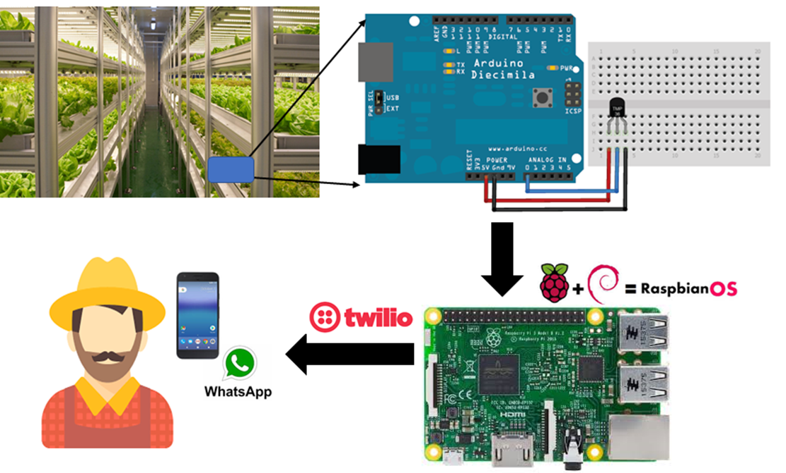

# 라즈베리파이로 시작하는 핸드메이드 IoT

* http://www.yes24.com/Product/Goods/78869304?scode=032&OzSrank=1
* https://www.aladin.co.kr/shop/wproduct.aspx?ItemId=207807446
* http://www.kyobobook.co.kr/product/detailViewKor.laf?barcode=9791190014489
* https://ridibooks.com/v2/Detail?id=3780000055&_s=search&_q=%EB%9D%BC%EC%A6%88%EB%B2%A0%EB%A6%AC%ED%8C%8C%EC%9D%B4%EB%A1%9C

과거에는 소프트웨어 개발자들이 소프트웨어에 관련된 개발을 주로 해왔기 때문에 깊이 있는 하드웨어 지식이 필요하지 않았다. 그러나 최근에 소프트웨어를 탑재하는 하드웨어의 범위가 넓어지면서 소프트웨어 개발자도 하드웨어 지식을 알고 있어야 하드웨어를 효과적으로 제어할 수 있는 소프트웨어를 개발할 수 있게 되었다. 최근에 소프트웨어 개발자들이 쉽게 접할 수 있는 개발 보드들(예제: 라즈베리파이, 아두이노, UDOO 등) 이 출시되었다. 

이러한 하드웨어들의 중심에 라즈베리파이가 있다. 라즈베리파이는 영국 잉글랜드의 라즈베리파이 재단이 학교와 개발도상국에서 기초 컴퓨터 과학의 교육을 증진시키기 위해 개발한 신용카드 크기의 싱글 보드 컴퓨터이다. 그리고, 라즈베리파이를 만든 라즈베리파이 재단은 재단의 CEO인 에벤 크리스토퍼 업톤(Eben Christopher Upton)과 다른 공동설립자들이 교사, 대학교, 그리고 아이들에게 컴퓨터에 대한 영감을 주려고 노력하는 컴퓨터 열광자들을 모아 만든 곳이다. 라즈베리파이는 비 영리적인 목적을 추구하고 있기 때문에 저비용으로 자신의 임베디드(Embedded Solution)을 만들려고 하는 학생, 개발자, Start-up(초보) 에게 매우 인기가 많다. www.raspberrypi.org 웹사이트에서 무료로 많은 정보들을 접할 수 있다. 

이 책은 독자들이 온라인 쇼핑몰들을 통하여 쉽게 접할 수 있는 라즈베리파이 보드를 활용한다. 백 번 읽는 것보다 한 번 해보는 것이 유익하다는 철학 아래 다양한 예제들 을 학습할 수 있도록 내용을 충실히 구성하였다.

모쪼록 이 책을 통해 많은 대한민국의 더 많은 학생들이 라즈베리파이 보드에 더 친숙 해질 수 있으면 한다. 그렇게 되면 라즈베리파이 보드를 이용하여 더 많은 자신만의 작품들을 뚝딱뚝딱 개발할 수 있는 시점이 어느새 올 것이다. 그 상황이 오게 되면 왜 우리가 더 컴퓨터에 대한 학문적으로 더 깊이 배우고 더 연구해야 하는지 본연의 고민에 대해 생각하고 의미 있는 동기부여를 받는 순간이 오리라 믿는다.

# 부품 리스트
찹터별로 준비해야 하는 부품 리스트들을 열람하기위하여 [**여기**](accessory-list.md)를 클릭하여 주세요.

# 활용 예제: 스마트 팩토리
아래의 그림은 5장 18절의 "**온도 정보 수신하는 왓츠앱 서비스 개발하기**"의 예제를 보여주고 있다. 아래의 그림은 스마트 팩토리를 직접 구축하는 방법을 보여주고 있다. 예를 들어 도시형 식물 공장에 재배중인 채소들이 적정 온도를 유지하며 잘 자라고 있는지 실시간으로 관리자에게 알려주는 기능을 나타내고 있다. 만약 각종 농수산물 채소들을 보관하는 창고의 온도가 기계의 고장으로 또는 갑작스러운 기후 변화로 인하여 적정 온도를 유지하는 것이 불가능한 경우에 재배중인 채소들이 죽게되어 막대한 손실을 가져올 것이다. 이때 그림의 예제는 농수산물 창고의 온도가 적정 온도 이상으로 올라가거나 반대로 적정 온도 이하로 내려간다면 즉시 농수산물 채소 관리자의 스마트폰에 설치되어 있는 왓츠앱으로 실시간으로 위험 경고 메세지를 보냄으로써 불의의 재난 또는 사고를 사전에 예방하는 시스템을 만드는 예제를 그림으로 전체 동작구조를 설명하고 있다. 

